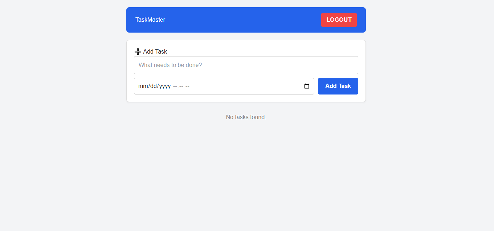

# TaskMaster - Full Stack Task Management App

A modern, full-stack Task Management application built with the PERN stack (PostgreSQL, Express, React, Node.js).

## 🚀 Features
- **User Authentication**: Secure Login and Registration using JWT (JSON Web Tokens) and bcrypt password hashing.
- **Password Visibility**: Toggle eye-icon to show/hide password during login.
- **CRUD Operations**: 
  - **Create**: Add tasks with descriptions and due dates.
  - **Read**: View a personalized list of tasks.
  - **Update**: Edit existing task content and deadlines.
  - **Delete**: Remove tasks from the database.
- **Protected Routes**: Only logged-in users can access the dashboard.
- **Responsive UI**: Clean interface built with React and custom CSS.

## 🛠️ Tech Stack
- **Frontend**: React.js, Axios, React Router
- **Backend**: Node.js, Express.js
- **Database**: PostgreSQL
- **Security**: JWT, Bcrypt

## ⚙️ Setup Instructions

### Backend
1. Navigate to the `backend` folder.
2. Install dependencies: `npm install`.
3. Create a `.env` file with your DB credentials and JWT Secret.
4. Start the server: `npm run dev`.

### Frontend
1. Navigate to the `frontend` folder.
2. Install dependencies: `npm install`.
3. Start the app: `npm run dev`.

## 📸 Preview
